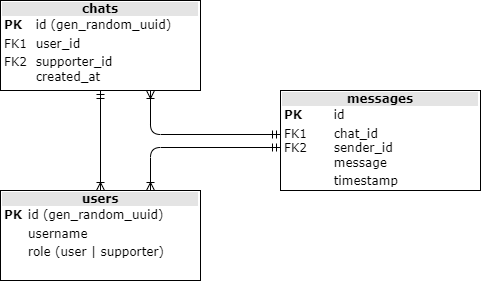
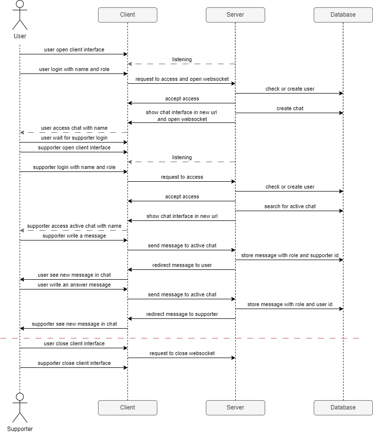
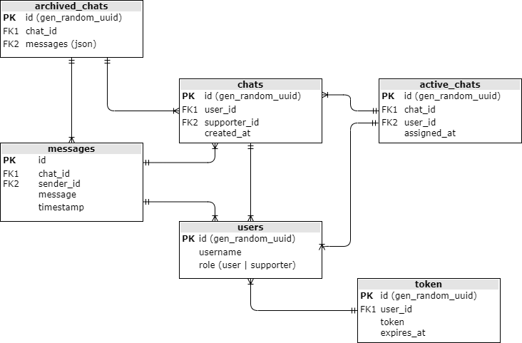

# JobRad Customer Chat

---
## Task
Imagine a situation where you need to implement a chat software for our customer service to interact with our customers.

**How would the quick win solution look like and how would the state-of-the-art solution look like?**

Implement a simple solution for a chat that enables customers to send messages to customer service.

### Talking points / topics to be considered:

- Which objects / classes would you create?
- How do they interact?
- How does the frontend interact with your classes?
- Which enhancements come to your mind when talking about chat software solutions?
---

## Init repository over make

For the first setup of the repository, start `make` in the command line from the root directory. The Makefile stored
for this will automatically set up the following preparations for you:

- Initialize the venv directory (based on Python 3.11 - please check the install path)
- Update pip
- Installation of pre-commit and autopep8
- Installation of the requirements for function and tests.


## Start server at the development level

- Navigate to `/function/server` and execute `python main.py`
- Server will create logs under `/logs/server.log`
- Webinterface will deploy under: [http://127.0.0.1:8000/](http://127.0.0.1:8000/)
- Chat interface will generate under: [http://127.0.0.1:8000/{uuid}/{username}](http://127.0.0.1:8000/{uuid}/{username})

## Build and start server over docker

- Navigate to root directory `/`
- **! Important:** Before saving the image, switch from the Powershell to the cmd console. If the save command is executed
  in the Powershell console, the error message “archive/tar: invalid tar header” is displayed when the image is loaded
  on a Linux server.
- Execute in console (change the version number before you execute)
  ```bash
  docker build -t jobrad_customer_chat:<VERSIONSNUMMER> -t jobrad_customer_chat:latest .
  cmd
  docker save jobrad_customer_chat:latest > jobrad_customer_chat.tar
  ```
- Zip the tar-file to tar.gz
- Transfer image zip file and docker-compose.yml to server
- Load the docker image and start the customer chat server container
  ```bash
  docker load < viki-heat_<VERSIONSNUMMER>.tar.gz
  docker-compose up -d
  ```

## Run pytest and generate code coverage review

- Navigate to root directory `/`
- Run in console `pytest`
- The test result is displayed in the console, saved in a `/.coverage` file and as an html view in the `/htmlcov`
  directory

---

## Version 1 - Web-based basic chat

The first version will provide basic chat functionality. It will be possible for a user to establish a connection to
the server. The supporter can then establish a connection to the server, which will establish a connection to the same
chat of the user. Users and supporters can then use websockets to communicate with each other.

### :white_check_mark: Must have

- [x] client-server-model over web interface
- [x] FastAPI for better websockets integration
- [x] docker container for server and database
- [x] relational database based on PostgeSQL with psycopg2 library
- [x] preventing SQL injections with prepared statements
- [x] asynchronous communication for faster data transfer, more scalable, resource-efficient and better for integration
      in later versions
- [x] use of websockets for data exchange and better expandability
- [x] uuid for users and chats
- [x] log server errors to `/var/logs/chat/` in docker container
- [x] time zone is set to Europe/Berlin to enable standardized time stamps
- [x] Simple Webinterface based on HTML and Javascript
- [ ] Test coverage must be at least 80% based on unit tests

### :arrow_upper_right: Nice to have

- [ ] Supporter can take over & end chats
- [ ] After logging into the chat, the user is shown the status of the connection:
  - “Waiting for supporter”
  - “Chat active”
  - “Chat was ended by the supporter”

### :x: Dont do this

- No sql-injection protection
- No tests
- No type hints and docstrings
- No documentation of code and functionality

### :clipboard: Architecture




## Version 2 - Secure web-based chat
In the second version, the basic chat will be expanded to include the security factor. In addition, a multi-chat
functionality is to be implemented so that several users can open a chat at the same time and the supporter can
actively participate in one or more of the chats using a list of open chats. A supporter should also be able to
create a chat themselves and send the link to the chat to a user so that they can use it to log in.

### :white_check_mark: Must have

- [ ] saving passwords exclusively encrypted via bcrypt
- [ ] communication encryption via AED
- [ ] the supporter can select a chat from a list of active chats and join it
- [ ] the supporter can open a chat and send the user an invitation link
- [ ] when a user logs on to the chat, a session token is created which is valid for 1 hour
- [ ] if the session token has expired, the user must log in again
- [ ] The session token should be structured as follows
    ```json
    {
       "user_id": "123e4567-e89b-12d3-a456-426614174000",
       "role": "user",
       "exp": 1700000000
    }
    ```
- [ ] Simple Webinterface based on HTML and Javascript
- [ ] Test coverage must be at least 80% based on unit tests

### :arrow_upper_right: Nice to have

- [ ] automatic archiving of chats after 1 week in a separate database

### :x: Dont do this

- No sql-injection protection
- No tests
- No type hints and docstrings
- No documentation of code and functionality

### :clipboard: Architecture



## Version 3 - Secure web-based chat, incl. automatic text module suggestions

In the third version, an AI will be created based on the chat histories already stored in version 2, which will
a preselection of possible answers for the supporter, which will be interpreted on the basis of the user's questions.
The supporter should then be able to click on an answer, which is then sent directly to the user, and rate it for the
system with a thumbs up or thumbs down button in response to the suggestions.

### :white_check_mark: Must have

- [ ] Evaluate the table of archived chats
- [ ] Data preparation for the creation of a training-, test- and validation-data set
- [ ] Training of an AI for automatic answer finding
- [ ] 3 answers should always be suggested, which have the highest weighting for the question
- [ ] Implementation of a new endpoint to provide the answers
- [ ] Implementation of a new function to automatically send clicked answers from the supporter to the user
- [ ] Test coverage must be at least 80% based on unit tests

### :arrow_upper_right: Nice to have

- [ ] Testsystem zum primären Bewertung von Antworten (Reinforcement Learning)
- [ ] Testsystem zur Korrektur von "fast richtigen" Antworten (Reinforcement Learning)

### :x: Dont do this

- No sql-injection protection
- No prompt-injection protection
- No tests
- No type hints and docstrings
- No documentation of code and functionality

### :clipboard: Architecture


## Version 4 - Secure ai-based web chat, incl. RAG knowledge database

In version 4, support will be provided by an AI chatbot in the first instance. A knowledge database is to be created
and a RAG system integrated. If the chatbot is unable to answer the user's questions, the active chat, including the
previous conversation, is forwarded to a supporter.

### :white_check_mark: Must have

- [ ] Create a knowledge database for support
- [ ] Use `pgvector` library to create a vector knowledge database
- [ ] Integrate communication between a local OpenAI ChatGPT instance in MS Azure and the server
- [ ] Add new endpoint for messages from user to chat AI
- [ ] Integrate a Retrieval Augmented Generation (RAG) system that primarily queries the answers from the knowledge base
- [ ] Test coverage must be at least 80% based on unit tests

### :arrow_upper_right: Nice to have

- [ ] Add a backend solution that allows employees to edit and update the knowledge database
- [ ] Add a rating system for the user so that they can rate the automatic responses as good or bad.

### :x: Dont do this

- No sql-injection protection
- No prompt-injection protection
- No tests
- No type hints and docstrings
- No documentation of code and functionality

### :clipboard: Architecture
